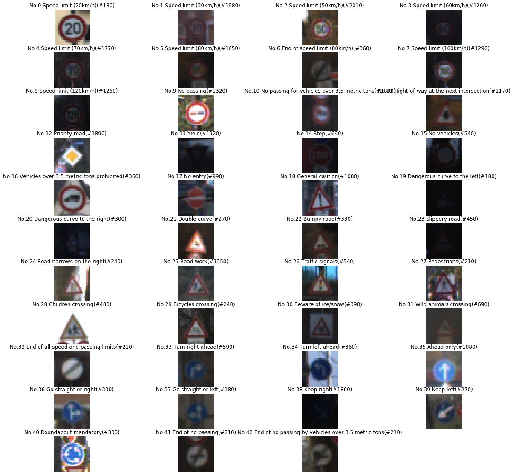

#**Traffic Sign Recognition** 

**Build a Traffic Sign Recognition Project**

The goals / steps of this project are the following:
* Load the data set (see below for links to the project data set)
* Explore, summarize and visualize the data set
* Design, train and test a model architecture
* Use the model to make predictions on new images
* Analyze the softmax probabilities of the new images
* Summarize the results with a written report

## Rubric Points

### Submission Files

This project includes

- The notebook `Traffic_Sign_Classifier.ipynb` (and `signames.csv` for completeness)
- `Traffic_Sign_Classifier.html`, the exported HTML version of the python notebook
- A directory `myData` containing images found on the web
- `README.md`, Is the writeup for the project

---

### Data Set Summary & Exploration

#### 1. Provide a basic summary of the data set and identify where in your code the summary was done. In the code, the analysis should be done using python, numpy and/or pandas methods rather than hardcoding results manually.

- Number of training examples = 34799
- Number of valid examples= 4410
- Number of testing examples = 12630
- Image data shape = (32, 32, 3)
- Number of classes = 43

#### 2. Include an exploratory visualization of the dataset and identify where the code is in your code file.

See the result in cell 8 of [notebook](https://github.com/vijaychavan007/Traffic-sign-classifier/blob/master/Traffic_Sign_Classifier.ipynb)

---

### Design and Test a Model Architecture

#### 1. Describe how, and identify where in your code, you preprocessed the image data. What tecniques were chosen and why did you choose these techniques? Consider including images showing the output of each preprocessing technique. Pre-processing refers to techniques such as converting to grayscale, normalization, etc.

The code processing images in cell 11 of [notebook](https://github.com/vijaychavan007/Traffic-sign-classifier/blob/master/Traffic_Sign_Classifier.ipynb)

Although colors in the traffic sign are important in real world for
people to recoganize different signs, traffic signs are also different
in their shapes and contents. We can ignore colors in this problem
because signs in our training set are differentiable from their
contents and shapes, and the network seems having no problem to learn
just from shapes.

Therefore, My preprocessing phase normalizes images from [0, 255] to
[0, 1], and grayscales it. You can see the grayscale effects in cell
11.

#### 2. Describe how, and identify where in your code, you set up training, validation and testing data. How much data was in each set? Explain what techniques were used to split the data into these sets. (OPTIONAL: As described in the "Stand Out Suggestions" part of the rubric, if you generated additional data for training, describe why you decided to generate additional data, how you generated the data, identify where in your code, and provide example images of the additional data)

The train, valid and test data are prepreocessed in cell 11. I use
cross validation to split training data. The code to split the data
is in function `train` (see cell 16).

To cross validate my model, I randomly split the given training sets
into training set and validation set. I preserved 10% data for
validation. `sklearn` has the handy tool `train_test_split` to do the
work.

#### 3. Describe, and identify where in your code, what your final model architecture looks like including model type, layers, layer sizes, connectivity, etc.) Consider including a diagram and/or table describing the final model.

The code is in function `classifier` (see cell 14).

I adapted LeNet architecture: Two convolutional layers followed by one
flatten layer, drop out layer, and three fully connected linear
layers.

1. convolution 1: 32x32x1  -> 28x28x12 -> relu -> 14x14x12 (pooling)
2. convolution 2: 14x14x12 -> 10x10x25 -> relu -> 5x5x25   (pooling)
3.       flatten: 5x5x25   -> 625
4.      drop out: 625      -> 625
5.        linear: 625      -> 300
6.        linear: 300      -> 150
7.        linear: 150      -> 43

#### 4. Describe how, and identify where in your code, you trained your model. The discussion can include the type of optimizer, the batch size, number of epochs and any hyperparameters such as learning rate.

The code for training the model is in cell 15.

I train the model in 10 iterations (epochs), and each iteration is
trained with 64 batch size. Adam optimizer is used with learning rate
0.001.

#### 5. Describe the approach taken for finding a solution. Include in the discussion the results on the training, validation and test sets and where in the code these were calculated. Your approach may have been an iterative process, in which case, outline the steps you took to get to the final solution and why you chose those steps. Perhaps your solution involved an already well known implementation or architecture. In this case, discuss why you think the architecture is suitable for the current problem.

The code for calculating the accuracy of the model is in cell 16, 17, 18.

My final model results were:
* training set accuracy of 0.997 (overfitting the cross validation)
* validation set accuracy of 0.944
* test set accuracy of 0.928

The first model is adapted from LeNet architecture. Since LeNet
architecture has a great performance on recognizing handwritings, I
think it would also work on classifying traffic signs.

I used the same parameter given in LeNet lab. Its training accuracy
initially was around 90%, so I thought the filter depth was not large
enough to capture images' shapes and contents. Previously the filter
depth was 6 for the first layer and 12 for the second. I increased
to 12 and 25. The accuracy increased to around 93%.

I then added a drop out layer, which is supposed to used to prevent
overfitting, but I found a drop out layer could sometimes increase the
accuracy to 95%.

I also tuned `epoch`, `batch_size`, and `rate` parameters, and settled at

- `epoch` 10
- `batch_size` 64
- `learning rate` 0.001

I have my explainations of the effect of the drop out layer after I've
seen some of the training data. Some images are too dark to see the
sign, so it seems that these images act as noises in the training data
and drop out layer can reduce the negative effects on learning.

The final accuracy in validation set is around 0.95.

### Test a Model on New Images

#### 1. Choose five German traffic signs found on the web and provide them in the report. For each image, discuss what quality or qualities might be difficult to classify.

The chosen signs are visualized in cell 26

.

I want to see how the classifier performs on similar signs. The
General Caution and Traffic signals: they both look like a vertical bar
(see the visualization) when grayscaled. And pedestrains and child
crossing look similar in low resolution.

#### 2. Discuss the model's predictions on these new traffic signs and compare the results to predicting on the test set. Identify where in your code predictions were made. At a minimum, discuss what the predictions were, the accuracy on these new predictions, and compare the accuracy to the accuracy on the test set (OPTIONAL: Discuss the results in more detail as described in the "Stand Out Suggestions" part of the rubric).

The code for making predictions on my final model is in cell 27. The
result is explained and virtualized in detail in cell 29.

The accuracy on the new traffic signs is 0.818, while it was 93% on
the test set. This is a sign of underfitting. By looking at the
virtualized result, I think this can be addressed by using more image
preprocessing techniques on the training set.

